<!-- ── CIRCUIT HEADER ─────────────────────────────────────────── -->

 

<!-- ── TYPING ANIMATION ───────────────────────────────────────── -->
<a href="https://git.io/typing-svg">
  +building+where+circuits+meet+code;>+FPGA+%C2%B7+embedded+C+%C2%B7+AI+pipelines+%C2%B7+full-stack+web;>+open+to+PEY+Co-op+%26+internships+%C2%B7+2027;>+Computer+Engineering+%40+UofT+%C2%B7+Class+of+%2729" alt="Typing SVG" />
</a>

---

### languages

### frontend & backend

### embedded systems & hardware

-f4f6fa?style=for-the-badge&logoColor=3a4a6b)

---

### experience

**Exiger** &nbsp;·&nbsp; SWE Intern &nbsp;·&nbsp; Summer 2026  
> Product Engineering team building AI-powered supply chain  
> and risk intelligence platforms. Focus on B2B integrations and APIs.

**NeurotechUofT** &nbsp;·&nbsp; Software Member &nbsp;·&nbsp; Sep 2025 – Present  
> Real-time biosignal processing pipelines (sEMG/EEG) and ML models  
> for tremor detection in an assistive exoskeleton.

**ECE297** &nbsp;·&nbsp; Team Member &nbsp;·&nbsp; Winter 2025  
> Real city graph in C++: sub-second shortest-path queries across 100K+ intersections  
> with a heuristic courier router approximating an NP-Hard multi-stop pickup-and-delivery problem.

---

### what i've built

<!-- PINNED_REPOS_START -->
| project | stack | about |
|:---|:---|:---|
| [linkedin_notion_tool](https://github.com/dareen-nasreldin/linkedin_notion_tool) | `Python` | A Python-based automation tool designed to streamline the internship search process. This utility automates job discovery and tracking by scraping data from LinkedIn and Indeed, saving key details directly to a private Notion database. |
| [NOMinEAT](https://github.com/dareen-nasreldin/NOMinEAT) | `React` `Express` `PostgreSQL` `Prisma` `Tailwind` | NOMinEAT solves the "where should we eat?" dilemma for groups. Members NOMinate restaurants, genres, or locations, cast weighted 👍👎 votes, and the group's Top NOM is revealed when the session host ends it. Built as a mobile-first web app with a clean API boundary, the same backend is designed to power a React Native mobile app in the future. |
| [flappy-FPGA-verilog](https://github.com/dareen-nasreldin/flappy-FPGA-verilog) | `de1-soc` `modelsim` `quartus-prime` `verilog` | A hardware-based implementation of a "Flappy Bird" style obstacle game, written in Verilog for Altera/Intel DE-Series FPGA boards. This project utilizes a custom VGA controller for graphics, PS/2 keyboard for input, and 7-segment displays for score tracking. |
| [VGA-Music-Sequencer](https://github.com/dareen-nasreldin/VGA-Music-Sequencer) | `C` | An embedded step sequencer implemented in C on the DE1-SoC FPGA board. Compose music on a sheet-music-style grid rendered over VGA, play it back in real time through the onboard audio output, and edit notes live using a PS/2 keyboard. |
| [Remi](https://github.com/ryabalta/Remi) | `Python` | Remi – AI Memory Assistant is an interactive Python application that enhances memory and focus through conversational, voice-based exercises. Using real-time speech recognition, adaptive difficulty, and visual progress tracking, Remi delivers a personalized cognitive training experience that evolves with the user. |
| [CircuitMind](https://github.com/dareen-nasreldin/CircuitMind) | `JavaScript` |  |
<!-- PINNED_REPOS_END -->

---

### stats

---

### connect

 

